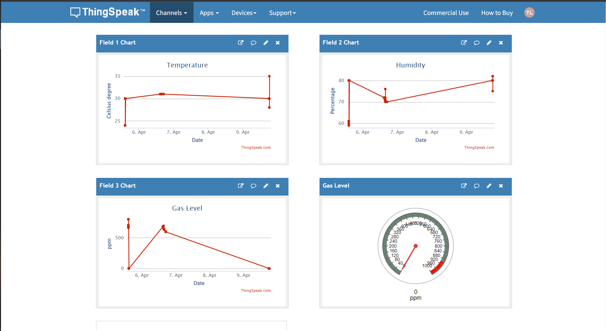
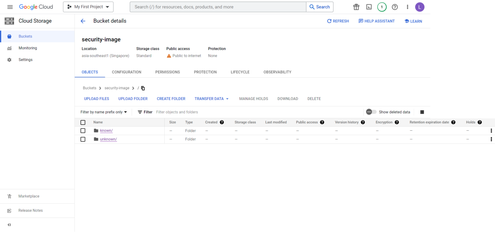
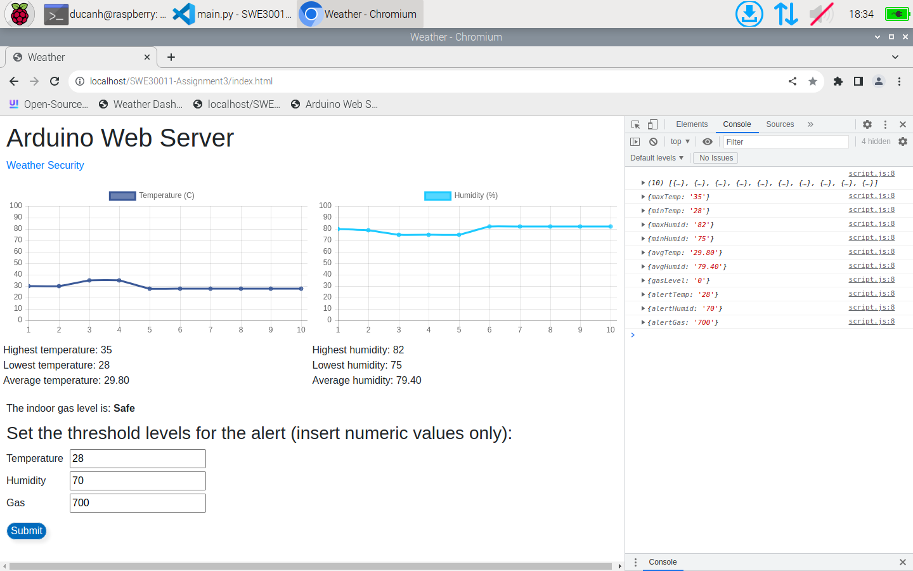
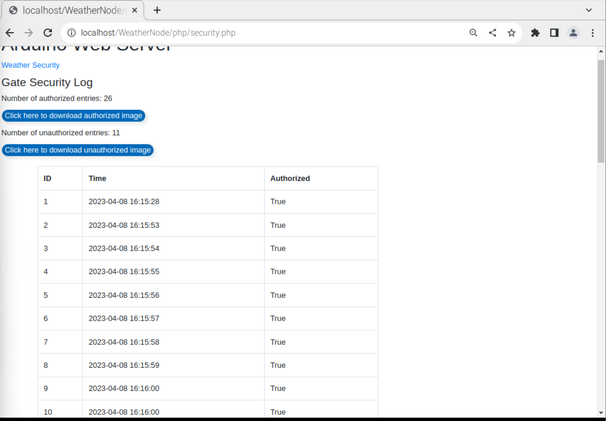

# Smart-and-Security-Home-System

## Introduction

For this project, we aim to develop a smart home system for sensing and security using IoT nodes and edge devices. By using sensors, a webcam, cloud servers, and a user interface, the homeowner can not only monitor in-door environment statistics (temperature, humidity, gas level) but also detect and alert real-time security threats to increase safety in their home.

## Conceptual Design

 
_Figure 1: Overall system_

 
_Figure 2: Weather monitor node_

 
_Figure 3: Door security node_

 
_Figure 4: Window security node_

 
_Figure 5: Camera attach to Raspberry Pi in door/gate security node_

\*_The camera will be attached to the door node's edge device_

## Implementation

### Sensing System

#### Weather Node

- DHT11: Measure temperature and humidity
- MQ-2: Measure gas level
- 16x2 LCD: Display temperature and humidity values
- 3 LEDs: Each LED is associated with a sensing value and actuates when the value(s) is/are higher than the set threshold(s)
- Buzzer: Actuate when the gas level is higher than the set threshold

#### Door Node

- Camera: Captures video images for face detection and recognition
- Keypad: For entering password
- Servo motor: Acts as a lock for the door
- 2 LEDs: Red indicates an unauthorized attempt to unlock the door and green indicates authorized access through the door.
- Buzzer: To alert unauthorized attempts and send short buzzes when the door is unlocked

#### Window Node

- SW-520D: Tilt sensor to detect window status
- Buzzer and LED: To alert when unauthorized attempts to open the window

### Edge Servers

Each IOT node uses one Raspberry Pi as an edge device. The Arduino communicates with Raspberry Pi through serial communication while the Raspberry Pi communicate with each other through MQTT protocol. The Raspberry Pi also hosts the user interface as a web server.

#### Weather Node

- Collect and store data from Weather, Door, and Window Arduino to the database and control the actuators
- Host the user interface website
- Run Mosquitto MQTT broker
- Run Mosquitto MQTT subscriber to receive data from other nodes
- Run Discord to send messages and allow users to interact with the Weather Node

#### Door Node

- Use OpenCV to detect and recognize faces
- Register the user's credentials to the database
- Publish the face recognition result to the MQTT broker
- Run Discord to send messages and allow users to interact with the Door Node
- Upload captured images to the Google Cloud Platform

#### Window Node

- Collect data from Window Arduino
- Publish the data to the MQTT broker
- Run Discord to send messages and allow users to interact with the Window Node

### Communication Protocols

#### Serial Communication

Arduino <-> Raspberry Pi

#### MQTT

Node <-> Node

### API and Web Design

#### API

- Discord API
- Google Cloud Platform API
- ThingSpeak API

#### Web Design

- HTML
- CSS
- JavaScript
- PHP
- Chart.js
- Bootstrap

### Cloud Computing

- Google Cloud Platform

 
_Figure 6: Thingspeak dashboard_

- ThingSpeak

 
_Figure 7: GCP images_

## User Manual

### Website

- Weather: view statistics and data visualization of temperature, humidity, and gas level, set threshold for each value, and control the actuators

 
_Figure 8: Weather dashboard_

- Security: 2 logs for door and window security. View the captured images of the door

 
_Figure 9: Security dashboard_

### Discord

To view commands, type '/howto' in the chat box. The list of commands will be displayed.

 
_Figure 10: Discord commands_

## Limitations and Improvement Approaches

- Simple website design, limited options for users to interact with the system
- An app will be better than Discord for users to interact with the system
- Performance can be slow when the system is overloaded with multiple requests
- Potential usage of cloud computing to improve performance
